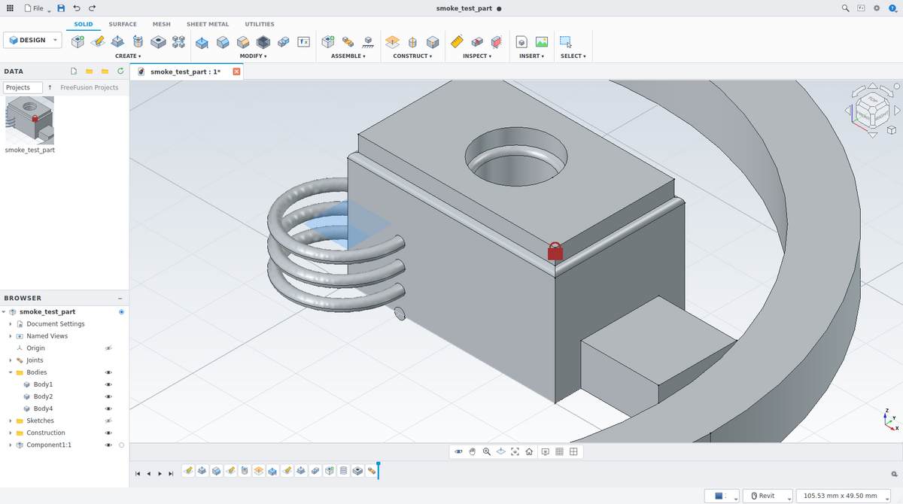
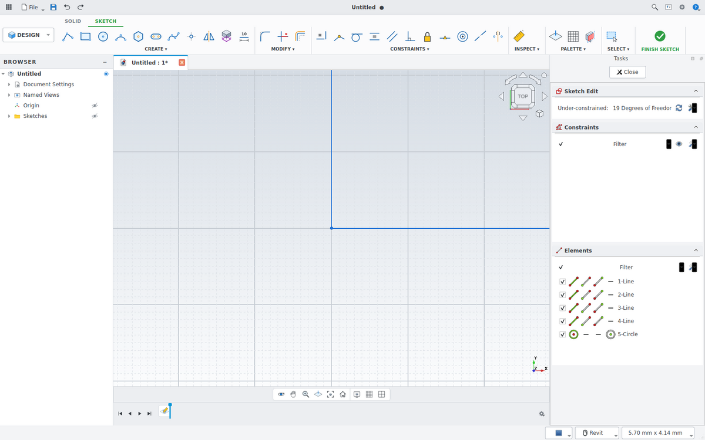
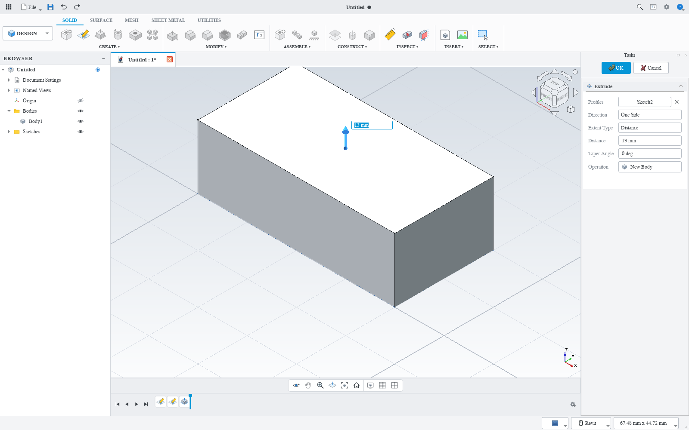
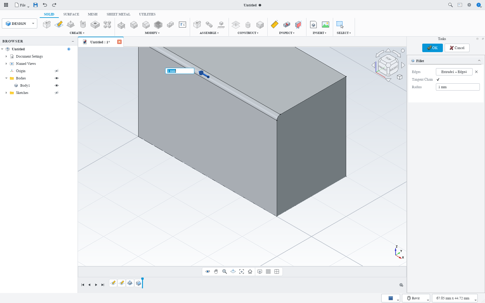
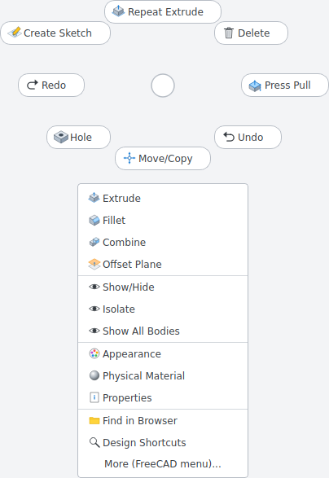

# FreeFusion

**FreeCAD with a Fusion 360 style workspace.** Local files only, no cloud.



FreeFusion is a FreeCAD add-on (a workbench plus a launcher). It changes how FreeCAD
looks and how you work in it, so the layout, workflow, mouse, keys and dialogs feel
like Autodesk Fusion 360. Everything below the UI is still FreeCAD: files are plain
`.FCStd`, and every FreeCAD workbench stays one click away.

| Fusion 360 | FreeFusion |
|---|---|
| Tabbed toolbar with CREATE ▾ / MODIFY ▾ / CONSTRUCT ▾ … groups | Same ribbon: **SOLID, SURFACE, MESH, SHEET METAL, UTILITIES**, plus a contextual **SKETCH** tab with **FINISH SKETCH** |
| Workspace switcher (DESIGN ▾) | DESIGN, RENDER, ANIMATION, SIMULATION (FEM), MANUFACTURE (CAM), DRAWING (TechDraw), and all FreeCAD workbenches |
| Browser | Browser with Document Settings, Named Views, Origin, Bodies, Sketches, Construction, Components, Joints, eye toggles and component activation |
| Timeline | Timeline with a draggable history marker (roll back / forward), edit, suppress, delete and rename, with new features inserted at the marker |
| Marking menu (right-click) | Radial marking menu with flick gestures, plus a context list |
| **S** shortcut box | **S** opens a search box over every FreeFusion and FreeCAD command, with pinned favourites |
| Fusion shortcuts | E, Q, F, H, M, J, I, A, V, S · sketch: L, R, C, D, P, T, O, X (all remappable) |
| Middle-drag pan, Shift+middle orbit, wheel zoom | Same, plus double-middle-click to fit, and nav-bar Orbit/Pan/Zoom modes for left-drag |
| ViewCube top right, light canvas, blue selection | NaviCube styled like the ViewCube, gradient canvas, ground grid, Fusion colours |
| Extrude with Join / Cut / Intersect / New Body / New Component | Same operations, live preview, sketch *profiles* (click regions), Direction, Extent, Taper, To Object |
| Drag arrows and value boxes on the canvas | Extrude, Press Pull, Fillet, Chamfer and Offset Plane show a drag arrow with a value box. Drag it (the value snaps to round numbers) or just type a number and press Enter |
| Sketch snapping | The cursor locks to round values that follow the zoom (1, 2, 5, 10 …) and to endpoints, midpoints and centers. Hold Ctrl to draw freely |
| Fillet / Chamfer with Tangent Chain | Same: pick edges (or faces) on several bodies, tangent edges are added automatically, edit it again from the timeline |
| Sketches belong to components, not bodies | Same: one sketch can drive several bodies |
| Change Parameters (user + model parameters) | Same dialog. Type `width / 2` or `1 in` in any value field. Dimensions are named d1, d2 … |
| Data Panel | Local **Data Panel** (grid icon, top left): project folders in `~/FreeFusion Projects` and recent designs, shown with thumbnails |
| Sketch Palette | **PALETTE** group on the SKETCH tab: Look At, Sketch Grid, Snap, Slice, Show Profile |
| Light and dark theme | Both, switchable at runtime |

| Sketching (SKETCH tab, Finish Sketch) | Extrude: drag arrow and value box | Fillet with the value box | Marking menu |
|---|---|---|---|
|  |  |  |  |

## Install

You need **FreeCAD 1.0 or newer** (1.1 recommended). FreeFusion is pure Python and
works on any distribution: FreeCAD from your package manager, Flatpak, or an AppImage.

### Arch Linux

```sh
sudo pacman -S freecad
git clone https://github.com/oreo1298/FreeFusion.git
cd FreeFusion/packaging/arch
makepkg -si          # builds and installs the freefusion-git package
freefusion
```

### Any distribution (per user, no root)

```sh
git clone https://github.com/oreo1298/FreeFusion.git
cd FreeFusion
./scripts/install.sh                  # installs to ~/.local, adds a menu entry
./scripts/install.sh --freecad-addon  # optional: also show the workbench inside regular FreeCAD
freefusion
```

Other options: `--system` (to `/usr/local`, needs root), `--dev` (symlink the checkout
instead of copying it), `--uninstall`.

### As a plain FreeCAD add-on

Clone or symlink the repository into FreeCAD's `Mod` folder, then pick **FreeFusion**
from the workbench list:

```sh
# FreeCAD 1.1 uses a versioned folder; 1.0 uses ~/.local/share/FreeCAD/Mod
git clone https://github.com/oreo1298/FreeFusion.git ~/.local/share/FreeCAD/v1-1/Mod/FreeFusion
```

In this mode your normal FreeCAD preferences stay as they are. Use **UTILITIES ›
Apply Fusion Navigation & Colors** to switch to Fusion navigation, colours and the
ViewCube, and **Restore FreeCAD Settings** to undo it.

### The `freefusion` launcher

`freefusion` starts FreeCAD with the add-on loaded and a **separate settings profile**
(`~/.config/freefusion/user.cfg`), so it behaves like a dedicated app without touching
your regular FreeCAD setup. It finds FreeCAD on your `PATH`, as a Flatpak
(`org.freecad.FreeCAD`) or as an AppImage in `~/Applications`. To use a specific binary:

```sh
FREECAD=~/Applications/FreeCAD_1.1.4-Linux-x86_64-py311.AppImage freefusion
freefusion --reset-profile      # start over with FreeFusion's defaults
```

## Using it

**Mouse:** middle-drag pans, Shift + middle-drag orbits, the wheel zooms at the
cursor, and a double middle-click fits the view. Right-click opens the marking menu;
right-drag in a direction runs that command immediately.

**A typical part:**

1. Press **L** (or **CREATE › Create Sketch**). Click a plane or a planar face.
2. Draw. The cursor snaps to round values on the sketch grid and to endpoints,
   midpoints and centers (hold **Ctrl** to turn snapping off). While drawing, type
   a length or angle in the boxes next to the cursor (Tab moves between them).
   **D** dimensions, **X** toggles construction, **T** trims, **O** offsets.
   Click **FINISH SKETCH** (or press **E** to go straight to Extrude).
3. **E** (Extrude): click the closed regions you want, set the distance and pick the
   operation. It starts as *New Body* on an empty design, *Join* or *Cut* on a body face
   depending on direction, and *Join* when the tool overlaps a body.
   Drag the blue arrow, or type a number (it goes into the box next to the arrow) and
   press **Enter**.
4. **F** fillets the selected edges. **Q** press-pulls faces (on edges it fillets).
   **H** puts a hole where you click.
5. Drag the timeline marker back to change history, then double-click an item to edit it.

**Components and joints:** **ASSEMBLE › New Component** creates and activates a
component. Use the radio button in the Browser to choose the active component.
**J** opens FreeCAD's joint dialog on the design's root assembly (Fixed, Revolute,
Slider, Cylindrical, Ball, Distance and more). **Ground** fixes a component in place.

**Parameters:** **MODIFY › Change Parameters** manages user parameters (stored in a
spreadsheet named *Parameters*) and every model dimension. Any value field accepts
units and expressions using parameter names.

### Keyboard

| Key | Model | Sketch |
|---|---|---|
| S | Design shortcuts / search | same |
| E | Extrude | finish sketch and extrude |
| Q | Press Pull | |
| F | Fillet | |
| H | Hole | |
| M | Move/Copy | |
| J / Shift+J | Joint / As-built joint | |
| I | Measure | Measure |
| A | Appearance | |
| V | Show/Hide | |
| L R C D P | sketch tools (asks for a plane first) | Line, 2-point rectangle, circle, dimension, project |
| T O X | | Trim, Offset, Construction |
| F6 / Ctrl+B / Ctrl+N | Fit / Compute all / New design | |
| Enter / Esc | OK / cancel the running command | Esc stops the current sketch tool |

Remap keys in **UTILITIES › Keyboard Shortcuts**. FreeCAD's own `Ctrl` shortcuts keep
working.

## How it maps onto FreeCAD

* **Design / components.** A new design gets a root `Assembly` (a FreeCAD `App::Part`),
  so components can be jointed. Components are `App::Part` objects; bodies are
  `PartDesign::Body`.
* **Sketches live in components.** Features reach them through hidden
  `SubShapeBinder`s inside each body. That is how one Extrude can cut three bodies,
  and how one sketch can feed several bodies.
* **Profiles** are the sketch's region faces (`MakeInternals`), so clicking inside a
  closed area selects that region. This needs FreeCAD 1.1; on 1.0, clicking a sketch
  uses all of its closed loops.
* **Extrude** becomes `Pad` for Join / New Body / New Component, `Pocket` in every target
  body for Cut, and a hidden tool body plus `Boolean (Common)` for Intersect. All objects
  of one command share a timeline group.
* **The timeline** order and marker are stored in the document (`Document.Meta`).
  Rolling back suppresses PartDesign features after the marker and moves each body's
  Tip, so new features are inserted at the marker.
* **Construction geometry** uses attached `Part::Datum*` objects. The attachment
  modes are chosen for you, like Fusion's construct tools.
* **Parameters** live in a spreadsheet (`FFParams`) with aliases. Expressions are
  standard FreeCAD expressions.
* **Editing stays in one workspace.** FreeCAD normally jumps to the Sketcher or Part
  Design workbench when you edit a sketch or feature. FreeFusion keeps you in its
  workspace, like Fusion.

Files made with FreeFusion open in any FreeCAD 1.0+ without the add-on.

## What Fusion features are not here

No cloud: no data panel, sharing, collaboration or cloud rendering. Fusion-only
technologies with no FreeCAD equivalent are also missing: T-spline **Form**
modeling, **Generative Design**, and automatic **Drawings from the timeline**.
TechDraw is available under DRAWING. Other gaps are covered by FreeCAD itself:

* **Sheet metal** needs the *SheetMetal* add-on (install it from UTILITIES › Add-on Manager).
* **Render** needs the *Render* add-on. **Simulation** is FreeCAD FEM and **Manufacture** is FreeCAD CAM.
* **Rib/Web** and **Emboss** have no direct equivalent yet.
* **Thread** creates a modeled ISO-style thread. PartDesign **Hole** covers tapped holes.
* **Snapping on FreeCAD 1.0:** a point placed exactly on a sketch axis is only as precise
  as the mouse pixel along that axis (FreeCAD 1.0 skips grid rounding there). FreeCAD
  1.1 rounds it exactly.

## Development

```sh
tests/run_headless.sh /path/to/freecadcmd                 # modeling logic (no GUI)
tests/run_gui.sh /path/to/freecad [outdir] [managed|plain] # GUI smoke test under Xvfb, writes screenshots
TEST=gui_input.py tests/run_gui.sh /path/to/freecad        # real keyboard/mouse input via xdotool
TEST=gui_manip.py tests/run_gui.sh /path/to/freecad        # sketch snapping and drag arrows (xdotool)
TIMEOUT=1500 TEST=gui_commands.py tests/run_gui.sh ...     # runs every FF_* command once
python3 tools/make_icons.py                               # regenerate the SVG icon set
```

Layout of the code:

* `freefusion/design.py`, `freefusion/timeline.py`, `freefusion/features/*` hold the modeling model and operations, with no GUI dependency.
* `freefusion/commands/definitions.py` defines every `FF_*` command.
* `freefusion/ui/*` holds the ribbon, browser, timeline, marking menu, key map, dialogs and theme.
* `freefusion/ui/layout.py` says what goes where in the ribbon and marking menu.

The icons are original artwork generated by `tools/make_icons.py`. FreeFusion is not
affiliated with Autodesk; *Fusion 360* is a trademark of Autodesk, Inc.

## License

LGPL-2.1-or-later, the same as FreeCAD.
